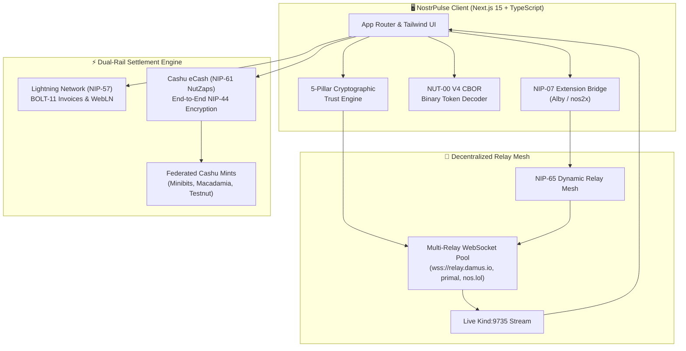
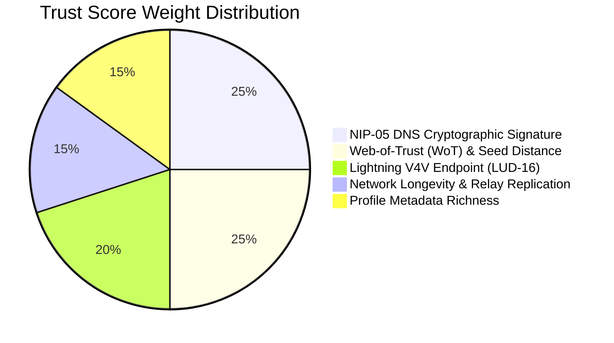
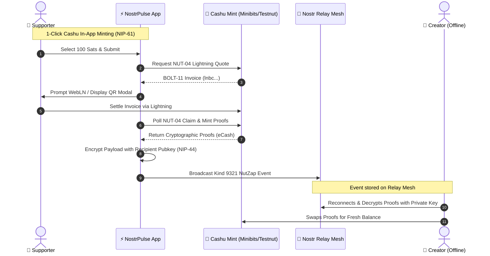

<div align="center">

# ⚡ NostrPulse
### Decentralized Identity Intelligence, Anti-Sybil Trust Engine & Dual-Rail Bitcoin eCash Protocol

[](https://opensource.org/licenses/MIT)
[](https://bitshala.org)
[](https://github.com/nostr-protocol/nips)
[](https://cashu.space)
[](https://nextjs.org/)

<br />

<p align="center">
  <b>NostrPulse</b> is an open-source analytics engine and sovereign trust layer built on top of the <b>Freedom Tech Stack</b> (Nostr + Bitcoin Lightning + Cashu Chaumian eCash). It transforms raw cryptographic keypairs into verifiable reputation metrics while enabling friction-free, offline Value-4-Value micro-settlements.
</p>

<p align="center">
  <a href="https://nostrpulse.com"><b>Explore Live Demo »</b></a> •
  <a href="https://nostrpulse.com/about"><b>Methodology</b></a> •
  <a href="https://nostrpulse.com/relays"><b>Relay Telemetry</b></a> •
  <a href="https://nostrpulse.com/compare"><b>Versus Engine</b></a>
</p>

</div>

---

## 🌐 The Problem: Trust & Liquidity in Open Networks

Decentralized protocols like Nostr eliminate centralized choke points, but introduce two critical bottlenecks:
1. **Sybil Attacks & Impersonation:** Keypairs (`npub`) are costless to generate, allowing malicious actors and bot farms to easily forge creator identities[cite: 7].
2. **Payment Brittleness:** Traditional Lightning Zaps (NIP-57) require the recipient's node to remain online 24/7 with active routing liquidity.

| Dimension | Legacy Web2 (Walled Garden) | NostrPulse (Freedom Tech Stack) |
| :--- | :--- | :--- |
| **Identity Control** | Centralized databases, arbitrary deplatforming | **Cryptographic Sovereign Keypairs (`NIP-01 / NIP-19`)** |
| **Sybil Resistance** | Black-box algorithmic censorship & phone KYC | **Deterministic 5-Pillar Trust Score & Web-of-Trust** |
| **Monetization** | 30% App Store fees, custodial payout freezes | **0% Platform Fee Native Bitcoin Micro-tips** |
| **Settlement Rails** | Centralized bank rails (Synchronous only) | **Dual-Rail: Lightning (NIP-57) + Cashu eCash (NIP-61)** |

---

## 🏛️ System Architecture

NostrPulse coordinates a multi-layered decentralized pipeline spanning browser-level cryptography, public relay pools, and Chaumian mint nodes:



---

## 🚀 Core Innovations & Engineering Highlights

### 1. 🛡️ 5-Pillar Deterministic Trust Score & Anti-Sybil Damping
Rather than relying on vanity follower counts, NostrPulse evaluates account authenticity via a deterministic **0–100 point algorithm**[cite: 7]:



> **[!IMPORTANT]**
> **Anti-Sybil Damping Guard:** If an account lacks verified NIP-05 DNS signatures AND exhibits an isolated Web-of-Trust graph, its score is **strictly capped at 44 (Tier: Unverified / Potential Bot)**[cite: 7]. This neutralizes automated bots that populate fake metadata profiles.

---

### 2. ⚡ Dual-Rail Value-4-Value Engine (Lightning + Cashu eCash)

NostrPulse introduces a unified payment interface that switches seamlessly between synchronous and asynchronous Bitcoin micro-tipping:



* **Zero-Knowledge Asynchronous Tipping:** Delivers Chaumian eCash to creators even when their Lightning node is completely offline[cite: 7].
* **Native NUT-00 V4 CBOR Parsing:** Zero-dependency, lightweight binary parser supporting both legacy `cashuA` and next-gen `cashuB` tokens[cite: 7].
* **Dynamic Mint Router:** Switch dynamically between Minibits, Macadamia, Cashu Testnut, or private Mint endpoints[cite: 7].

---

### 3. 📡 Dynamic NIP-65 Relay Mesh & WebSocket Telemetry
* **NIP-65 Gossip Synchronization:** Discovers and connects to each creator's custom relay list (`Kind 10002`) instead of hardcoding centralized endpoints[cite: 6].
* **Live Browser Telemetry:** Real-time round-trip latency (ping) benchmarking across 12+ public relay hubs directly from client WebSockets[cite: 7].
* **Deduplicated Receipt Feed:** Real-time multi-threaded ingestion of `Kind 9735` Zap Receipts with instant visual confirmation[cite: 7].

---

### 4. ⚔️ Creator Versus Engine & Embeddable SVG Badges
* **Head-to-Head Compare:** Side-by-side metric comparison between any two Nostr identities (`npub` vs `npub`) across reputation, Lightning readiness, and metadata[cite: 7].
* **Dynamic Markdown/HTML Badges:** Automatically generated live SVG badges (`/api/badge/[npub]`) for GitHub READMEs and personal websites[cite: 6, 7].

---

## 📜 Protocol Specification Compliance

| Standard | Description | Implementation Status |
| :--- | :--- | :---: |
| **NIP-01** | Basic Nostr protocol specifications, event signing & relays | ✅ Active[cite: 7] |
| **NIP-05** | DNS-based internet identifier cryptographic verification | ✅ Active[cite: 7] |
| **NIP-07** | `window.nostr` browser extension capability (Alby, nos2x) | ✅ Active[cite: 7] |
| **NIP-19** | Bech32 encodings (`npub`, `nsec`, `note`, `nprofile`) | ✅ Active[cite: 7] |
| **NIP-44** | Standardized versioned end-to-end payload encryption | ✅ Active[cite: 7] |
| **NIP-57** | Lightning Zaps (`Kind 9734` request & `Kind 9735` receipt) | ✅ Active[cite: 7] |
| **NIP-61** | Cashu eCash NutZaps (`Kind 9321` encrypted eCash payload) | ✅ Active[cite: 7] |
| **NIP-65** | Relay list metadata (`Kind 10002`) for dynamic routing | ✅ Active[cite: 6, 7] |
| **NUT-00** | Cryptography & Token Format V3 (JSON) & V4 (CBOR Binary) | ✅ Active[cite: 7] |
| **NUT-04** | Minting operations via Lightning BOLT-11 quotes | ✅ Active[cite: 7] |

---

## 🛠️ Technology Stack

* **Framework:** Next.js 15 (App Router, Server Components, Streaming SSR)[cite: 7]
* **Language:** TypeScript (Strict type-checking on all cryptographic structures)[cite: 7]
* **Styling:** Tailwind CSS v4, Base UI, Lucide Icons[cite: 6, 7]
* **Core Libraries:** `nostr-tools` (v2.x), `@cashu/cashu-ts` (v4.x), `@noble/hashes`[cite: 7]
* **Zero-Buffer Client Engine:** Fully decoupled from Node.js `Buffer` globals using native browser `Uint8Array` primitives for zero-crash cross-browser reliability[cite: 7].

---

## ⚡ Quickstart & Local Setup

### 1. Clone the repository
```bash
git clone [https://github.com/PHONGUIT22/NostrPulse.git](https://github.com/PHONGUIT22/NostrPulse.git)
cd NostrPulse
```

### 2. Install dependencies
```bash
npm install
```

### 3. Run the development server
```bash
npm run dev
```

Open [http://localhost:3000](http://localhost:3000) to explore the live dashboard[cite: 7].

---

## 🗺️ Roadmap

- [x] **Milestone 1:** Deterministic 5-Pillar Trust Score Engine & Anti-Sybil Damping Guard[cite: 7].
- [x] **Milestone 2:** NIP-57 Lightning Zap integration with WebLN & live receipt streams[cite: 7].
- [x] **Milestone 3:** NIP-61 NutZap dual-mode engine with NUT-00 V4 CBOR decoding[cite: 7].
- [x] **Milestone 4:** NIP-65 dynamic relay synchronization & browser WebSocket telemetry[cite: 7].
- [ ] **Milestone 5:** NUT-11 (P2PK) locks for deterministic recipient-locked eCash NutZaps[cite: 7].
- [ ] **Milestone 6:** NIP-90 (Data Vending Machines) for automated AI Agent reputation verification[cite: 7].
- [ ] **Milestone 7:** Standalone `@nostrpulse/sdk` for seamless integration into third-party Nostr clients[cite: 7].

---

## ⚖️ License & Non-Custodial Disclaimer

Distributed under the **MIT License**[cite: 7]. NostrPulse is strictly non-custodial software: it never generates, stores, or requests user private keys (`nsec`), nor does it hold or intermediate user funds[cite: 7].

<div align="center">
  <sub>Built for <b>Bitshala Track 2: Freedom Stack Hackathon</b> • Sovereign Identity & Peer-to-Peer Cash</sub>
</div>